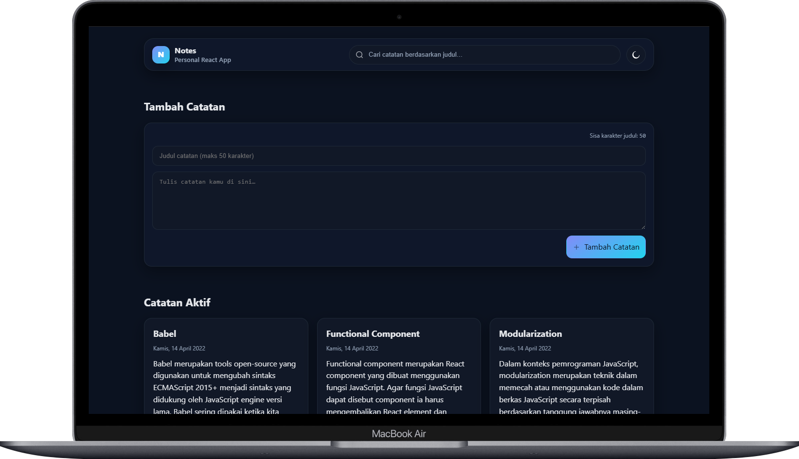

# Personal Notes App

Aplikasi catatan pribadi modern dan **responsif** berbasis **React (Vite)** untuk **menambah**, **mencari**, **mengarsipkan/memindahkan**, dan **menghapus** catatan.

<p align="center">
  
  
</p>

> Proyek ini dibuat untuk memenuhi _Submission Proyek Akhir: Membangun Aplikasi Catatan Menggunakan React_ pada kelas **Belajar Membuat Aplikasi Web dengan React** di platform **Dicoding**.  
> Seluruh **kriteria wajib** & **opsional** dipenuhi: pencarian, batas 50 karakter judul, serta fitur arsip.

---

## ✨ Fitur

- **Tambah catatan** (judul maksimal **50** karakter) & **konten** menggunakan **controlled component**.
- **Arsipkan / Pindahkan (Unarsip)** catatan — daftar **Aktif** dan **Arsip** terpisah.
- **Hapus** catatan.
- **Pencarian** berdasarkan judul (real‑time filter).
- **Empty state** yang jelas saat daftar kosong.
- **Dark / Light mode** dengan toggle dan **persist** via `localStorage` + auto‑detect preferensi OS.
- **Responsif**: navbar/header, form, dan grid kartu menyesuaikan layar mobile—search bar melebar penuh, tombol mudah disentuh.
- **Tombol berikon**: Arsip/Pindahkan & Hapus menggunakan **inline SVG** (ikon + teks, aksesibel).
- Tanpa state management eksternal — cukup **state lokal** untuk menjaga kesederhanaan.

> Data catatan disimpan **di memori** (hilang saat refresh) sesuai ruang lingkup kelas.

---

## 🧱 Teknologi

- **React 18+** dengan **Vite**
- **CSS murni** (CSS Custom Properties/variables + media queries)
- Tanpa framework UI / router / Redux (mudah ditambahkan bila dibutuhkan)

---

## 📁 Struktur Proyek

```
personal-notes-app/
├─ docs/
│  ├─ screenshot-dark.png
│  └─ screenshot-light.png
├─ public/
│  └─ favicon.svg
├─ src/
│  ├─ components/
│  │  ├─ EmptyState.jsx
│  │  ├─ Header.jsx
│  │  ├─ NoteCard.jsx
│  │  ├─ NoteInput.jsx
│  │  ├─ NoteList.jsx
│  │  ├─ SearchBar.jsx
│  │  ├─ Section.jsx
│  │  └─ ThemeToggle.jsx
│  ├─ hooks/
│  │  └─ usePrefersDark.js
│  ├─ utils/
│  │  └─ index.js          # data awal & helper tanggal
│  ├─ App.jsx              # komposisi halaman utama
│  ├─ index.css            # gaya global & variabel tema
│  └─ main.jsx             # entry ReactDOM
├─ .gitignore
├─ index.html
├─ package-lock.json
├─ package.json
├─ README.md
└─ vite.config.js
```

> Komponen dipisah **sekecil mungkin** (single responsibility) agar mudah dirawat & di‑uji.

---

## 🧩 Model Data

```ts
type Note = {
  id: number | string; // unik (disarankan: timestamp +new Date())
  title: string; // dibatasi 50 karakter (dengan counter)
  body: string;
  archived: boolean; // true = diarsip
  createdAt: string; // ISO date string
};
```

Data awal tersedia pada **`src/utils/index.js`**.

---

## 🚀 Menjalankan Proyek

### Prasyarat

- **Node.js** ≥ 18 (LTS disarankan)
- **npm** ≥ 9 (atau pnpm/yarn)

### Instalasi & Development

```bash
npm install
npm run dev
```

Buka alamat yang dicetak oleh Vite (default: `http://localhost:5173`).

### Build & Preview Production

```bash
npm run build
npm run preview
```

---

## 🔧 Komponen Kunci

- **Header** – Branding, **SearchBar**, dan **ThemeToggle**. Pada mobile, search otomatis melebar & turun ke baris berikutnya.
- **SearchBar** – Controlled input untuk pencarian judul (client‑side filter).
- **ThemeToggle** – Mengubah atribut `data-theme` pada `html`, persist ke `localStorage`, dan memanfaatkan **`usePrefersDark`** untuk mengikuti preferensi OS.
- **NoteInput** – Form tambah catatan: **counter judul** (50‑N), validasi sederhana, dan submit yang jelas.
- **NoteList** – Menampilkan kumpulan **catatan aktif** / **arsip**; memuat **EmptyState** jika kosong.
- **NoteCard** – Kartu catatan dengan aksi **Arsip/Pindahkan** dan **Hapus** (ikon + teks).
- **Section** – Pembungkus berjudul untuk memisahkan “Catatan Aktif” dan “Arsip”.
- **EmptyState** – Ilustrasi/pesan saat tidak ada catatan atau hasil pencarian.

---

## ♿ Aksesibilitas

- Ikon bersifat **dekoratif**, tombol tetap memiliki **label teks**.
- **Focus ring** terlihat jelas; warna diuji kontrasnya pada dua tema.
- Target interaksi mengikuti **ukuran sentuh** yang memadai.

---

## 🧪 Checklist Uji Manual

- Menambah catatan: counter judul berhenti di 50 & menampilkan sisa karakter.
- Pencarian menyaring judul baik di **Aktif** maupun **Arsip**.
- Arsipkan lalu pindahkan (unarsip) – kartu berpindah antar‑bagian.
- Hapus berfungsi di kedua bagian.
- Ganti dark/light, **refresh**: preferensi tetap sama.
- Coba lebar ≤ 640px – navbar/search rapi & mudah disentuh.

---

## 📦 Skrip npm

- `dev` – jalankan server pengembangan Vite
- `build` – build produksi
- `preview` – pratinjau hasil build secara lokal

---

## 🌐 Deployment

- **Vercel / Netlify** (preset **Vite**):
  - Build Command: `npm run build`
  - Publish Directory: `dist`

---

## 👤 Penulis

- GitHub: **https://github.com/irfandwisamudra**
